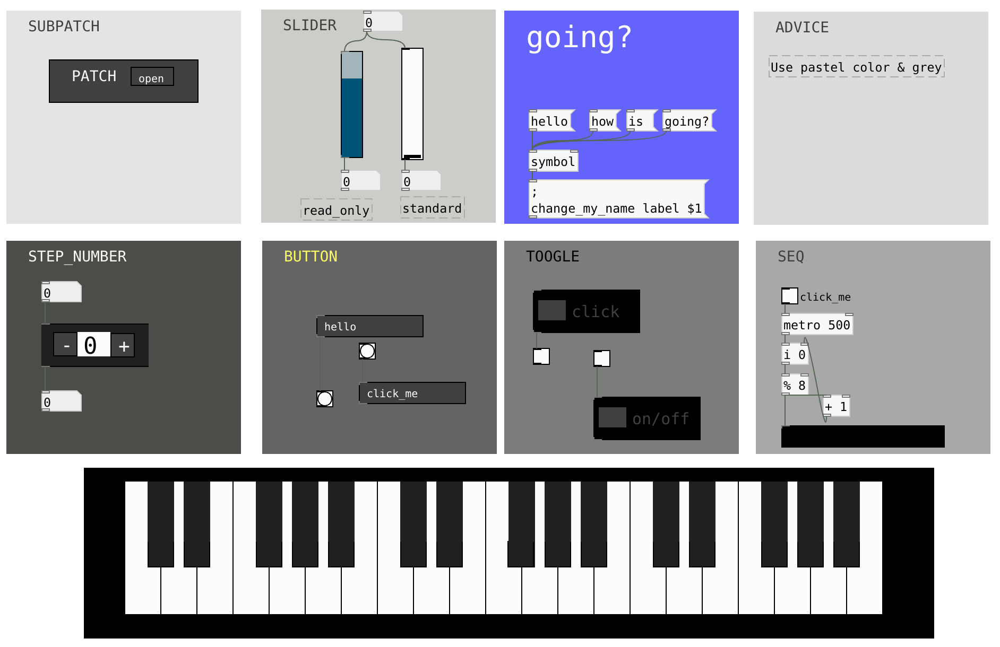

# Pure Data Advanced UI

This repository is a list of UI element that allow mid users and advanced user to make their patches good looking.

*is Pure Data is ugly by design ?*

The answer should be : **no** 

Thanks to purr-data, [https://github.com/agraef/purr-data](https://github.com/agraef/purr-data) , you are able now :

* Move back move front object

* Resize canva and Graph On Parent window from mouse

* Move label from mouse

* add images, gif, svg

=> Download purr-Data or this Pure Data Vanilla and then open MAIN.pd

Be curious, right-click and open everything

